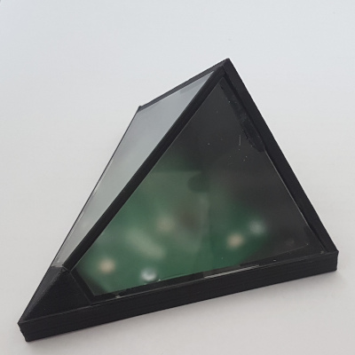

# uHUE

*A USB-controlled LED light/indicator*

|  |  |
|--|--|

The uHUE is a simple USB-controlled light/indicator that arose from my need to add an externally visible status indicator to a PC-based test station I'd created. The idea was that it would allow the user to monitor the status of a test without having to be able to see the display. The uHUE interfaces with the PC using a USB-to-serial converter, whilst an on-board microcontroller controls the LEDs.

The colour shown by the uHUE is specified using three 8-bit values - one each for red, green and blue. Three 'patterns' are possible when showing a colour: solid, blink and fade. For blink and fade, the cycle time can also be controlled.

The housing is designed to allow the LED colour being shown to be viewed over a 180° horizontal arc and 90° vertical arc. For simplicity, I opted to use integrated magnets hold the uHUE in place rather than a more permanent fixing method.

For more information:
- [Circuit](docs/circuit.md)
- [Housing](docs/housing.md)
- [Protocol](docs/protocol.md)
- [Assembly](docs/assembly.md)
