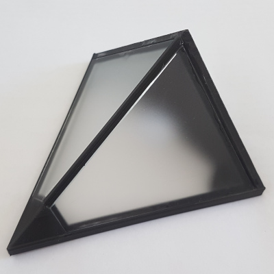
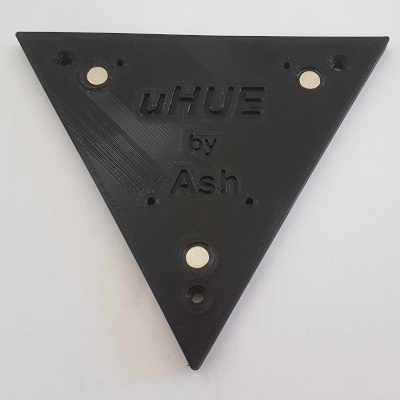
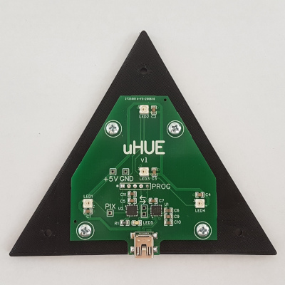
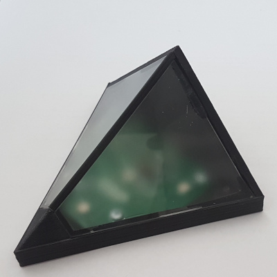

# Assembly

Assembly of the uHUE is pretty straightforward.

Finishing the PCB:
1. Solder on the USB connector (if using JLCPCB SMT assembly service).
2. Program the PIC microcontroller. I have access to a 'REAL ICE' programmer, but any PIC-compatible programmer will work.
3. Test the uHUE using the [Tester software](../software) to make sure everything is working properly.

Assemble the housing:
1. Glue two pieces of the frosted acrylic into the 'frame' part.
2. Glue the 'spine' to the frame and acrylic panes, again with epoxy.
3. Separately, glue the three magnets into the base.

I used epoxy that I applied with a toothpick to glue everything together.

Once the glue/epoxy has cured:
1. Secure the PCB onto the base using 4x screws.
2. Secure the base to the frame with 3x screws.

| _Frame with 'windows' and spine glued into place_ |
|:--:|
|  |

| _Base with magnet glued into place_ |
|:--:|
|  |

| _PCB attached to base_ |
|:--:|
|  |

| _Completed assembly_ |
|:--:|
|  |
