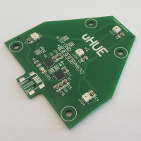
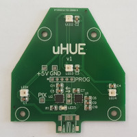

# Circuit

The uHUE uses four World Semi [WS2812B](datasheets/WS2812B.pdf) LEDs, controlled from a Microchip [PIC16F1704](datasheets/PIC16F1704.pdf). The PIC interfaces to the PC using a Silicon Labs [CP2104](datasheets/CP2104.pdf) USB-to-serial converter.

The WS2812B LEDs use a daisy-chained single-wire serial protocol to control the colour. It's a slightly odd protocol that uses different pulse widths to signify 1 and 0. Microchip have published an [application note](https://web.archive.org/web/20190417040127/http://ww1.microchip.com/downloads/en/AppNotes/00001606A.pdf) that explains how to use the Configurable Logic Cell (CLC) contained within some PICs to control the WS2812B. The app note is not written explicitly for the PIC16F1704 but is easily adapted.

I chose all components based on familiarity and the fact that I could have the PCBs assembled from in-stock items by JLCPCB. The only part I had to hand solder was the USB connector.

Below you can see the PCB as it came from JLCPCB, namely with all components except the USB connector.

