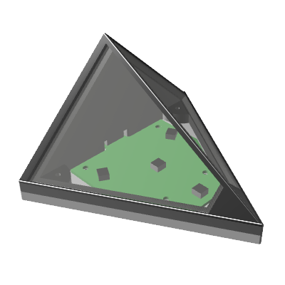
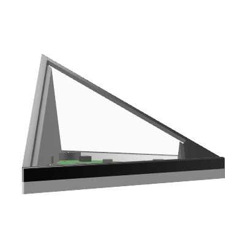
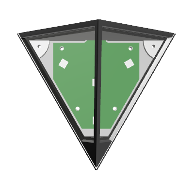
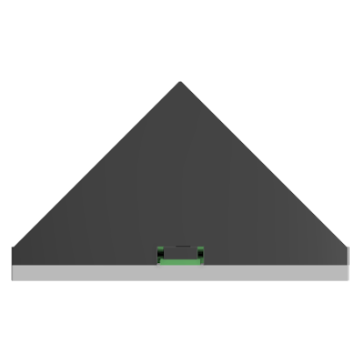
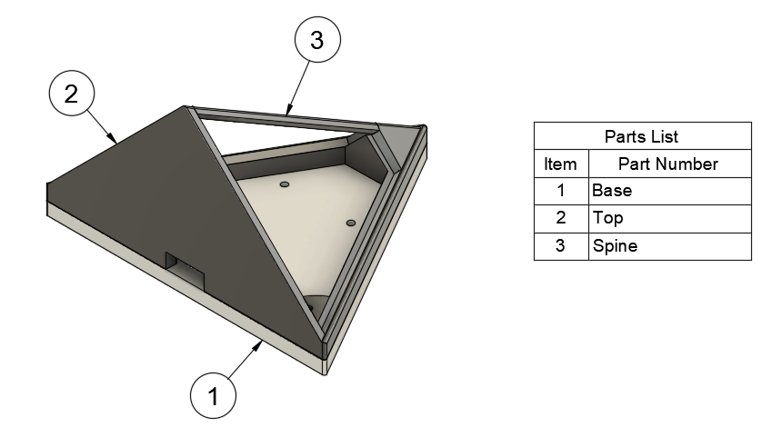

# Housing

For my use case, the uHUE was going to be mounted to an overhead cable tray, with the LEDs projecting downwards. To allow the colour to be seen from side on, the housing uses two angled pieces of frosted acrylic to diffuse the light. This provides visibilty over a 180° horizontal arc and a 90° vertical arc. The frosted acrylic also makes the uHUE "glow" as a whole, rather than four point sources of light. The unit is held in place using three integrated magnets that are glued into the base, used to anchor the uHUE to a metal cable tray.

The housing is made of four parts, three of which can be 3D printed using FDM: the base, the frame and the spine. The fourth part is the laser-cut frosted acrylic "window". Two pieces of the acrylic are required per unit.

